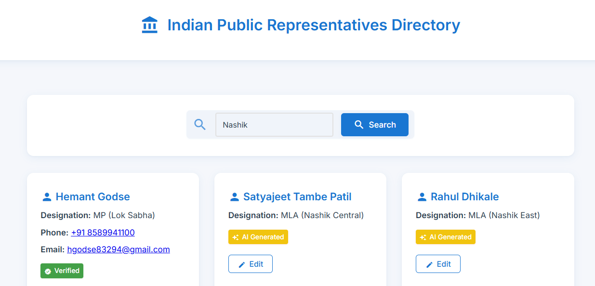

# Indian Public Representatives Directory
A web application that provides information about public representatives (MPs, MLAs) across Indian cities using Gemini AI and allows data verification.

## 🌐 Live Demo
You can access the demo version here: [https://repfinderai-1.onrender.com](https://repfinderai-1.onrender.com)

### ⚠ Note:
As this project is hosted for free on Render (a third-party hosting platform), it might take a few seconds to wake up initially (cold start) and may sometimes not display all data instantly.
This is normal behavior on free hosting tiers.

## Features

- 🔍 Search representatives by city
- 🤖 AI-powered data generation
- ✅ Verify and update contact information
- 💾 Data persistence with SQLite

## Quick Start

1. Install dependencies:
```bash
pip install -r requirements.txt
```

2. Create a `.env` file in the root directory:
```
GEMINI_API_KEY=your_api_key_here
```

3. Run the app:
```bash
python main.py
```

Visit `http://127.0.0.1:8000` and start searching!

## Tech Stack Analysis

- **Backend**: FastAPI (Python)
- **Database**: SQLite with SQLAlchemy (Async)
- **Frontend**: HTML, CSS, JavaScript
- **AI**: Google Gemini AI
- **Template Engine**: Jinja2

### 📸 Screenshots

|  |  |
|------------------------------|-------------------------|
---

### Strengths
- Clean, modern UI with responsive design
- Good separation of concerns
- Proper error handling
- AI integration for data generation
- Async operations for better UX

## Prerequisites

- Python 3.13+
- Google Gemini API Key

## Project Structure

```
Indian_Representative_Finder/
├── main.py              # FastAPI application and routes
├── database.py          # Database models and configuration
├── gemini_utils.py      # Gemini AI integration
├── requirements.txt     # Project dependencies
├── .env                 # Environment variables
├── static/              # Frontend assets
│   ├── styles.css      # Application styles
│   └── script.js       # Frontend JavaScript
└── templates/           # HTML templates
    └── index.html      # Main HTML template
